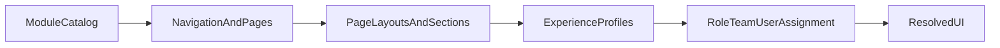

# Admin modularity

Organization admins shape what each user sees. End users do not pick modules from a catalog; they inherit **published configuration** and an **experience profile**.

## Configuration layers



| Layer | Admin controls | Example |
|-------|----------------|---------|
| **Module catalog** | Enable/disable MOD-03–MOD-13 | Turn on Revenue, off Business HR |
| **Navigation** | Show/hide routes and menu items | Hide Planning for warehouse staff |
| **Page layout** | Sections, widgets, field groups, order | Hide budget panel on project page |
| **Experience profile** | Bundle of the above | `FieldOps`, `ExecutiveSummary`, `Engineering` |
| **Assignment** | Map profile to role, team, or user | Sales team → `Revenue` profile |

## Resolution order

Effective UI for a signed-in user:

```
published org config
  ∩ assigned experience profile(s)   // most specific assignment wins on conflict
  ∩ optional user preferences        // only if admin allows per section
```

**MOD-01 (Core & access)** cannot be disabled in the catalog. Collaboration, insights, and platform capabilities remain available to the org; admins may hide nav entries (e.g. executive dashboards) via profiles.

## Disable module safely

When a module is disabled (`SCN-EXP-001`):

- Dependent nav and pages disappear.
- Deep links show a clear “module not enabled” state, not broken layouts.
- Data is retained unless admin runs an explicit export/archive flow (policy in `SCN-CORE-004`).

## Delegation

Org admin may delegate Experience Studio edit rights to trusted roles (`SCN-CORE-002`). Delegates cannot remove the break-glass org owner.

## Non-goals (v1)

- Arbitrary third-party widget marketplace
- Per-user custom CSS / full white-label HTML
- User-defined new pages outside the product page catalog

## Related scenarios

- [SCN-EXP-001](../scenarios/experience/SCN-EXP-001-module-catalog.md)
- [SCN-EXP-002](../scenarios/experience/SCN-EXP-002-navigation-and-page-visibility.md)
- [SCN-EXP-003](../scenarios/experience/SCN-EXP-003-page-layouts-and-profiles.md)
- [SCN-EXP-004](../scenarios/experience/SCN-EXP-004-setup-wizard-presets-publish.md)
